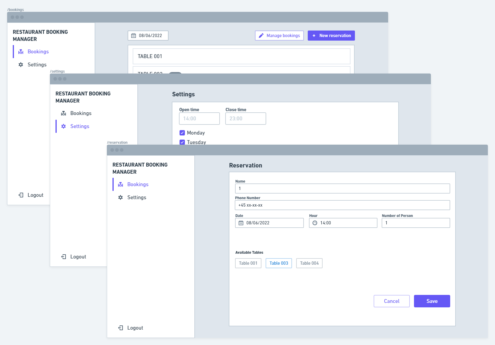
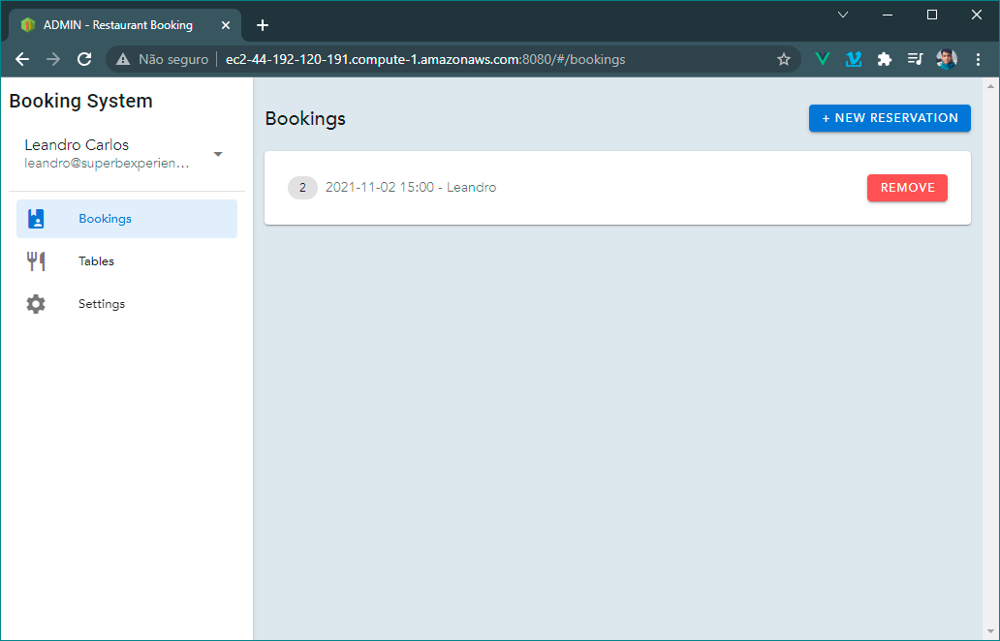
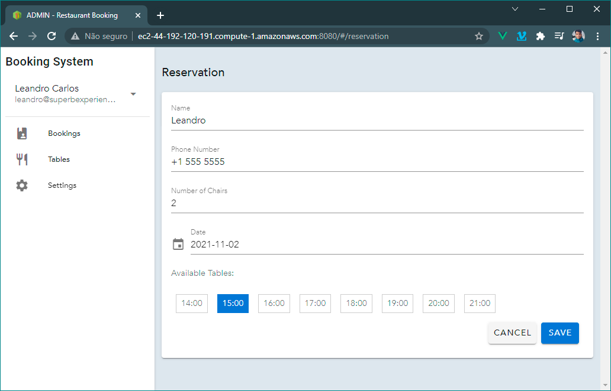
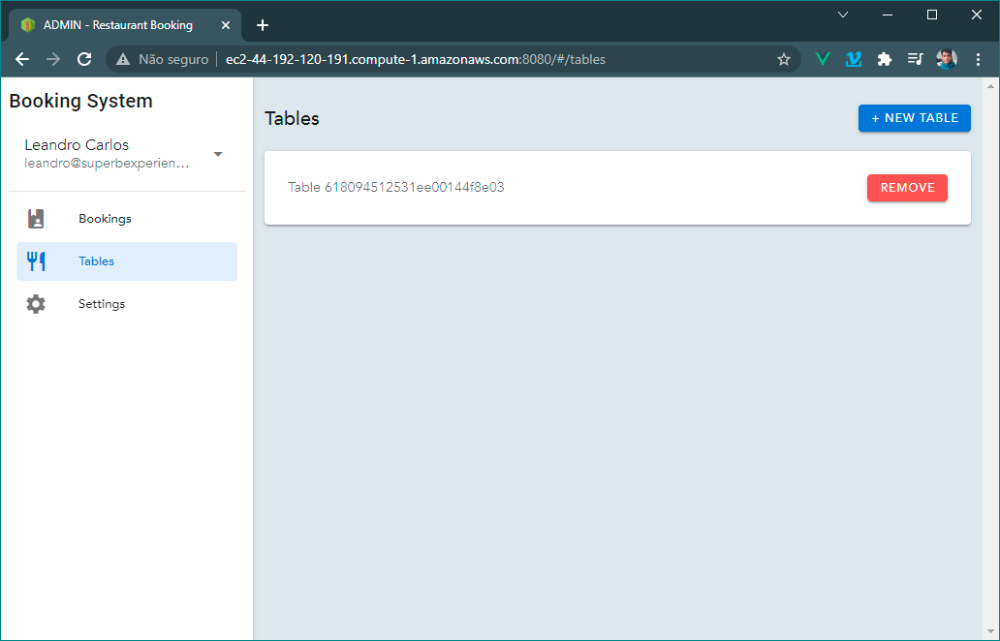
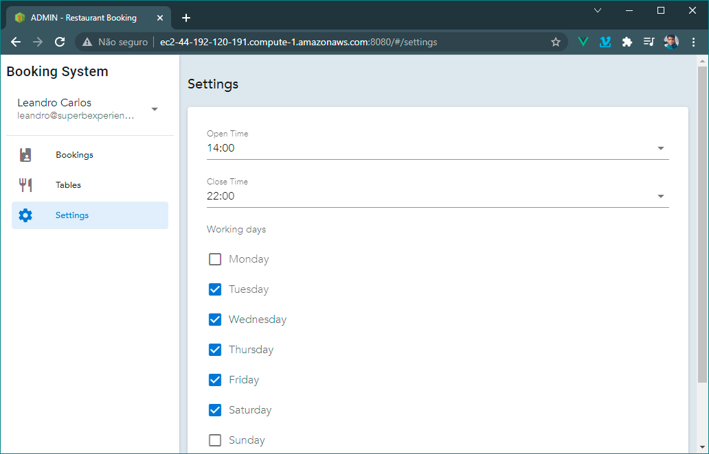

# SUPERB - Booking manager

Looking for the backend server repository? [Click Here](https://github.com/leandrocoder/superb-exercise-server)

## Restaurant owner system admin

Site for the restaurant's owner to manage bookings. In this page the user can view all the bookings, create or delete them, the same with the tables and also adjust the system settings.

- [Planing](#planing)
- [Framework](#framework)
- [How to use](#how-to-use)
- [Run and Build](#run-and-build)

## Planing

First of all, I draw the site sessions in the [Whimsical](https://whimsical.com), keeping in mind the simplicity and also trying to give a good user experience to the final clients.



*Basic planning for the admin system screens*


## Framework

The selected front end framework to this project is [Vue.js](https://vuejs.org/), combining to graphic framework [Vuetify](https://vuetifyjs.com/), cause of my previous familiarity and being simple to work enabling the focus on functionality.

All the requests are made using the native fetch browser api.

## How to use

In the Bookings Page, user can view a list of all bookings, create or remove them.



Clicking in the ```+ New reservation``` button, the user goes to a page where they can make a new one.

**Important:** The hour buttons may appear disabled depends of the availability of the tables, make sure there are tables available or create new ones in the tab ```/tables```. The user will only be able to make reservations for days where the restaurant will be open and in times gretter than ```Date.now()```.

The number of slots by time are equal of the number of tables, for example: If you have 1 table and the restaurant is open at 13:00, there 1 slot at 13:00, in case of two tables the number of people that can booking to 13:00 will be 2 as well.



In the Tables Page, user can view a list of all tables, create or remove them.



In the Settings page, the user can define the restaurant working hours and days.




## Run and Build

As a Vue.js application, to run use these commands:

```
npm i
npm run dev
```

To build use:

```
npm i
npm run build
```

For more instructions about Docker deployment in the AWS, go to [server`s documentation](https://github.com/leandrocoder/superb-exercise-server).


